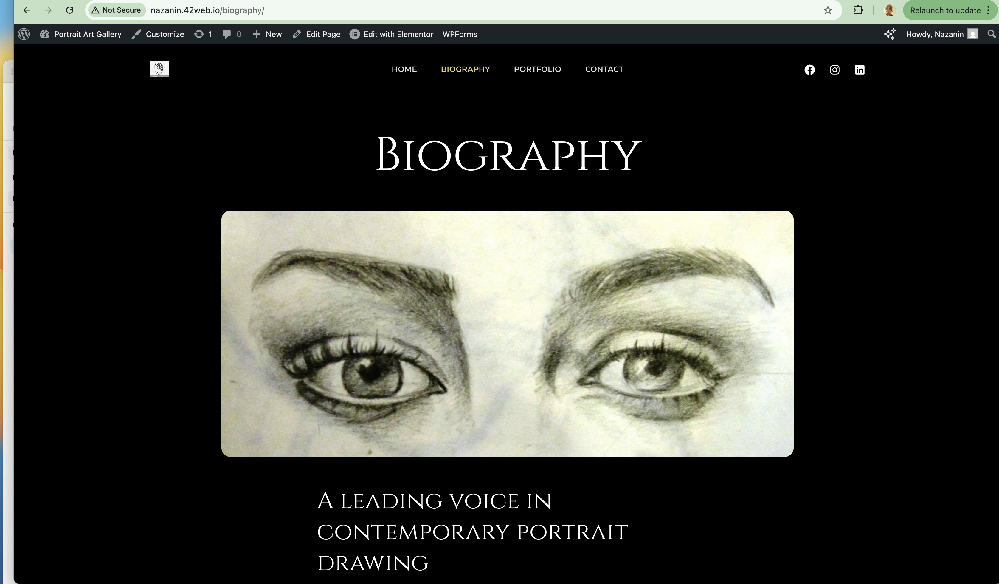
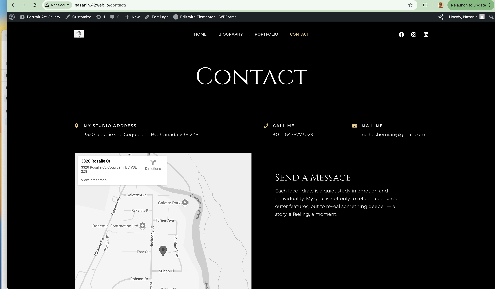

# 🎨 Nazanin's Art Gallery

This is a responsive art gallery website I built using **WordPress** and **Elementor**, showcasing my traditional, hand-drawn black & white artworks — primarily charcoal and pencil sketches. The design emphasizes simplicity and clarity to present my work in a professional, engaging way.

🔗 **Live Site**: [nazanin.42web.io](http://nazanin.42web.io)

---

## 🖼️ Project Description

- Built using WordPress + Elementor
- Focused on traditional (non-digital) art presentation
- Responsive design with subtle motion effects
- Clean, portfolio-style layout optimized for user experience

---

## 🚀 Purpose

This project was created to:

- Practice front-end development using WordPress & Elementor
- Build a live portfolio site for personal use
- Include in my resume and job applications as an example of site-building skills

---

## 🛠️ Tools & Tech

- WordPress
- Elementor
- Custom CSS (within Elementor)
- Hosted on 000webhost

---

## 📸 Screenshots

### 🏠 Home Page

### 🎭 Repertoire Page

### 👩 Biography Page

### 📬 Contact Page

